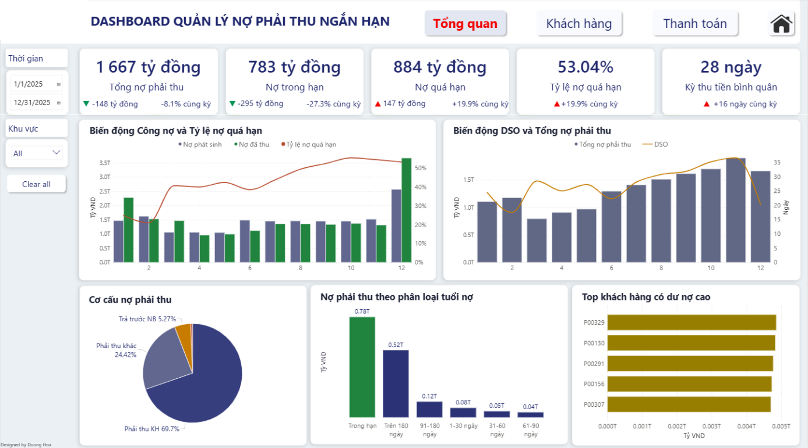
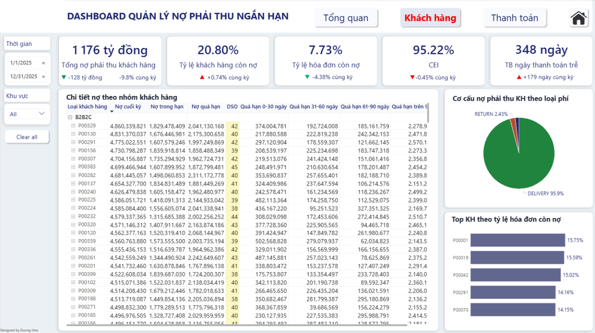
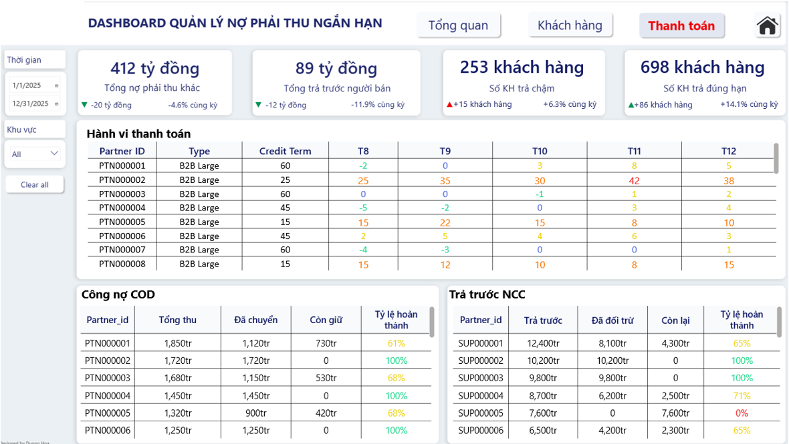

# Accounts Receivable Dashboard

## Project Overview

This project develops a Power BI dashboard for monitoring and analyzing short-term accounts receivable in a postal and delivery enterprise.

The dashboard was developed to support the analysis of receivables from multiple perspectives, including outstanding balances, overdue receivables, customer contribution, and payment behavior.

The project uses simulated data developed based on the business processes and characteristics of accounts receivable management in the postal and delivery industry.

> The dataset and analytical results are simulated for this project and do not represent the actual financial or operational performance of any specific company.

---

## Business Problem

Accounts receivable management in the postal and delivery industry involves multiple business processes, including order processing, delivery, invoicing, payment, COD reconciliation, and settlement.

The project focuses on supporting the monitoring of short-term accounts receivable and providing a more detailed analytical view of:

- Receivables scale and changes over time.
- Overdue receivables.
- Collection performance.
- Customer contribution to outstanding balances.
- Customer payment behavior.

The dashboard supports analysis from an overall view to customer and payment-level details.

---

## Project Workflow

```text
Business Understanding
        ↓
Data Simulation
        ↓
Data Preparation
        ↓
Galaxy Schema
        ↓
KPI Development
        ↓
Power BI Dashboard
        ↓
Receivables Analysis
        ↓
Recommendations
```

## Dashboard Structure

The dashboard consists of three analytical pages:

| Page     | Focus                                                                             |
| -------- | --------------------------------------------------------------------------------- |
| Overview | Overall receivables position, overdue debt, and collection performance.           |
| Customer | Customer outstanding balances, overdue receivables, and receivables contribution. |
| Payment  | Payment behavior and operational receivables.                                     |

The analytical flow follows:

```
Overview
   ↓
Customer
   ↓
Payment
```

## Key Results

The analysis of the simulated dataset identified several key findings:

- Total accounts receivable reached approximately VND 1,667 billion.
- Overdue receivables accounted for 53.04% of total receivables.
- Days Sales Outstanding (DSO) reached 28 days, exceeding the reference threshold of approximately 25 days.
- Collection Effectiveness Index (CEI) reached 95.22%.
- Receivables were primarily concentrated in Delivery fees.
- Delayed payments were mainly associated with large customers and flexible credit terms.

## Dashboard Preview

### Overview



### Customer



### Payment



## Data Model

The project uses a Galaxy Schema consisting of multiple fact and transactional tables connected through shared dimensions.

The model supports analysis across operational activities, invoicing, payments, settlement, and monthly accounts receivable snapshots.

<!-- Add data model image here -->

For more details, see [Data Model](docs/06-data-model.md).

## Project Documentation

| Document | Description |
|---|---|
| [01. Business Requirements](docs/01-brd.md) | Business context and analytical requirements. |
| [02. Business Glossary](docs/02-business-glossary.md) | Key business and receivables terminology. |
| [03. Data Profile](docs/03-data-profile.md) | Overview of the project data. |
| [04. Data Preparation and Quality](docs/04-data-preparation-and-quality.md) | Data preparation and quality considerations. |
| [05. Data Dictionary](docs/05-data-dictionary.md) | Description of dataset tables and fields. |
| [06. Data Model](docs/06-data-model.md) | Galaxy Schema and table relationships. |
| [07. KPI Definition](docs/07-kpi-definition.md) | KPI framework used in the dashboard. |
| [08. Dashboard Design](docs/08-dashboard-design.md) | Dashboard structure and analytical design. |
| [09. Key Findings](docs/09-key-findings.md) | Main findings from the analysis. |
| [10. Recommendations](docs/10-recommendations.md) | Recommendations based on project results. |
| [11. Limitations and Future Development](docs/11-limitations-and-future-development.md) | Current limitations and development directions. |

## Tools
- Power BI
- DAX
- Excel
- Python

## Project Scope

The project was developed as an analytical dashboard for short-term accounts receivable management in a postal and delivery enterprise.

The simulated dataset covers the business processes required for the project, including operational transactions, invoicing, payments, COD, settlement, and accounts receivable monitoring.

The project is intended to demonstrate the process of transforming business requirements and receivables data into a multidimensional analytical model and Power BI dashboard.

> The simulated dataset used for this project is not included in the repository due to file size and project data considerations.
